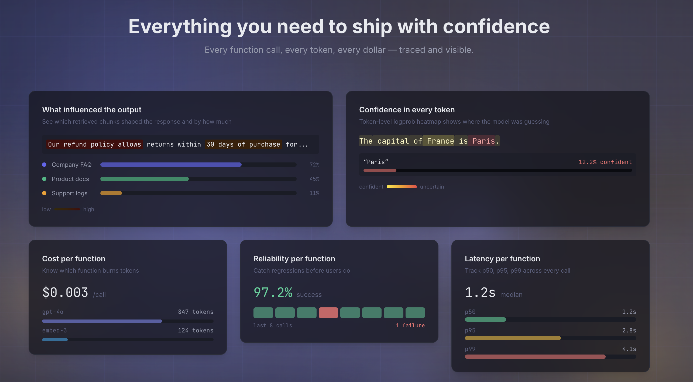
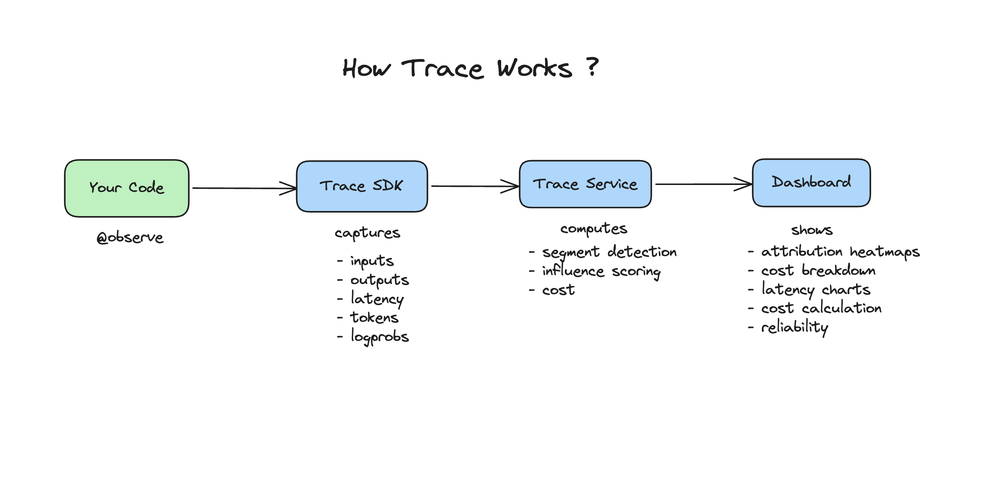

# Trace

[](https://pypi.org/project/usetrace/)
[](LICENSE)
[](https://github.com/sanyamsharma/trace/actions)
[](https://pypi.org/project/usetrace/)

> One decorator to trace your LLM apps — understand **why** the model said that, with latency, cost, and per-token attribution built in.

<!-- 📸 DIAGRAM: Hero screenshot of the Trace dashboard showing a trace detail view
     with the span tree on the left and attribution heatmap on the right.
     Current file: assets/trace.png — replace with a higher-res version if available. -->


---

## Why Trace?

Your LLM app hallucinated in production. A user screenshots the wrong answer, posts it on Twitter, and your Slack lights up.

You open your logs. You see the prompt. You see the completion. You see the latency.

But you can't answer the one question everyone is asking: **"Why did it say that?"**

Was it the retrieval? Did the model ignore the right documents? Was the system prompt ambiguous? Did you stuff too much context and drown out the actual query?

You don't know. You're guessing.

**Trace answers that question.** One decorator on your functions, and you get full execution traces with per-token attribution — which parts of your prompt actually influenced the output, and which parts the model ignored.

---

## Demo

<!-- 📸 DIAGRAM: Animated GIF or embedded video showing:
     1. Adding @tracer.observe() to a RAG pipeline
     2. Running the pipeline
     3. Opening the dashboard to see the trace tree
     4. Clicking into an LLM span to see the attribution heatmap
     Keep it under 30 seconds. Tools: screen recording → gifski or LICEcap. -->

---

## How It Works

<!-- 📸 DIAGRAM: Current file assets/trace-works.png — a flow diagram showing:
     Your Code → SDK captures spans → Trace API → Attribution Engine → Dashboard
     Consider redrawing with consistent visual style if updating other diagrams. -->


1. **Decorate** your functions with `@tracer.observe()` — works on sync and async, any LLM provider.
2. **The SDK captures** inputs, outputs, latency, token usage, and logprobs — then sends them to the Trace backend as batched spans in a background thread. Zero blocking on your hot path.
3. **The backend computes attribution** — it detects segments in your prompt (system instructions, retrieved chunks, user query, few-shot examples) and scores each segment's influence on the output using logprob analysis.
4. **The dashboard visualizes** the full execution tree and per-token attribution heatmaps so you can see exactly which context the model used and which it ignored.

---

## Quick Start

### Install

```bash
pip install usetrace
```

The SDK has only two dependencies: `pydantic` and `httpx`.

### Instrument your code

Add `@tracer.observe()` to any function you want to trace.

```python
import openai
from usetrace import Trace

tracer = Trace(api_key="tr-...", base_url="https://api.use-trace.com")
client = openai.OpenAI()


@tracer.observe(span_type="retrieval", tags={"source": "pinecone"})
def retrieve_context(query: str) -> str:
    results = pinecone_index.query(vector=embed(query), top_k=5)
    return "\n".join(match.metadata["text"] for match in results.matches)


@tracer.observe(span_type="llm", model="gpt-4o")
def generate_answer(question: str, context: str) -> str:
    response = client.chat.completions.create(
        model="gpt-4o",
        messages=[
            {"role": "system", "content": f"Answer using this context:\n{context}"},
            {"role": "user", "content": question},
        ],
        logprobs=True,  # enables per-token attribution maps
    )
    return response.choices[0].message.content


@tracer.observe(span_type="chain", tags={"pattern": "rag"})
def rag_pipeline(question: str) -> str:
    context = retrieve_context(question)
    return generate_answer(question, context)


answer = rag_pipeline("How does attention work in Transformers?")
```

Every call is captured — inputs, outputs, latency, token usage — and sent to the Trace backend as a nested execution tree: `rag_pipeline` → `retrieve_context` + `generate_answer`.

### View your traces

Open the [Trace dashboard](https://use-trace.com) to see your execution trees and per-token attribution maps.

<!-- 📸 DIAGRAM: Screenshot of the traces list page showing 3-4 traces with columns:
     function name, status, duration, tokens, cost, timestamp.
     Shows the at-a-glance production view. -->

---

## Examples

### OpenAI

```python
from usetrace import Trace
import openai

tracer = Trace(api_key="tr-...", base_url="https://api.use-trace.com")
client = openai.OpenAI()


@tracer.observe(span_type="llm", model="gpt-4o")
def summarize(text: str) -> str:
    response = client.chat.completions.create(
        model="gpt-4o",
        messages=[{"role": "user", "content": f"Summarize:\n{text}"}],
        logprobs=True,
    )
    return response.choices[0].message.content
```

### Anthropic

```python
from usetrace import Trace
import anthropic

tracer = Trace(api_key="tr-...", base_url="https://api.use-trace.com")
client = anthropic.Anthropic()


@tracer.observe(span_type="llm", model="claude-sonnet-4-20250514")
def analyze(text: str) -> str:
    message = client.messages.create(
        model="claude-sonnet-4-20250514",
        max_tokens=1024,
        messages=[{"role": "user", "content": f"Analyze this text:\n{text}"}],
    )
    return message.content[0].text
```

### Gemini

```python
from usetrace import Trace
from google import genai

tracer = Trace(api_key="tr-...", base_url="https://api.use-trace.com")
client = genai.Client(api_key="...")


@tracer.observe(span_type="llm", model="gemini-2.5-flash")
def summarize(text: str) -> str:
    response = client.models.generate_content(
        model="gemini-2.5-flash",
        contents=f"Summarize:\n{text}",
    )
    return response.text
```

### OpenAI-Compatible (Together, Fireworks, Groq, etc.)

Any provider that serves models through the OpenAI SDK format works out of the box — including logprobs and attribution maps.

```python
from usetrace import Trace
import openai

tracer = Trace(api_key="tr-...", base_url="https://api.use-trace.com")
client = openai.OpenAI(
    base_url="https://api.together.xyz/v1",
    api_key="tog-...",
)


@tracer.observe(span_type="llm", model="meta-llama/Llama-3-70b-chat-hf")
def generate(prompt: str) -> str:
    response = client.chat.completions.create(
        model="meta-llama/Llama-3-70b-chat-hf",
        messages=[{"role": "user", "content": prompt}],
        logprobs=True,
    )
    return response.choices[0].message.content
```

### RAG Pipeline

```python
from usetrace import Trace
import openai

tracer = Trace(api_key="tr-...", base_url="https://api.use-trace.com")
client = openai.OpenAI()


@tracer.observe(span_type="retrieval", tags={"source": "pg_vector"})
def search_docs(query: str) -> list[str]:
    rows = db.execute("SELECT content FROM docs ORDER BY embedding <=> %s LIMIT 5", [embed(query)])
    return [row.content for row in rows]


@tracer.observe(span_type="llm", model="gpt-4o")
def ask_with_context(question: str, docs: list[str]) -> str:
    context = "\n---\n".join(docs)
    response = client.chat.completions.create(
        model="gpt-4o",
        messages=[
            {"role": "system", "content": f"Answer using only this context:\n{context}"},
            {"role": "user", "content": question},
        ],
        logprobs=True,
    )
    return response.choices[0].message.content


@tracer.observe(span_type="chain", tags={"pattern": "rag"})
def rag(question: str) -> str:
    docs = search_docs(question)
    return ask_with_context(question, docs)
```

---

## Provider Support

Trace captures execution data from **any** LLM provider. Attribution maps require logprobs, which are only available from OpenAI-compatible APIs.

| Capability | OpenAI-compatible | Anthropic | Gemini |
|---|---|---|---|
| Input/output capture | ✅ | ✅ | ✅ |
| Latency tracking | ✅ | ✅ | ✅ |
| Token usage | ✅ | ✅ | ✅ |
| Cost tracking | ✅ | ✅ | ✅ |
| Model auto-detection | ✅ | ✅ | ✅ |
| Logprobs | ✅ | ❌ | ❌ |
| Per-token attribution maps | ✅ | ❌ | ❌ |

**OpenAI-compatible** includes: OpenAI, Together, Fireworks, Groq, Anyscale, vLLM, TGI, Ollama — any provider that returns logprobs in the OpenAI response format.

**Why no attribution maps for Anthropic and Gemini?** Attribution maps are built from **logprobs** (log-probabilities) — the model's confidence score for each token it generates. Trace uses these scores to compute which parts of your prompt actually influenced each output token. OpenAI-compatible APIs expose logprobs via `logprobs=True`. Anthropic and Gemini do not currently return logprobs, so Trace cannot compute per-token attribution for those providers. Tracing still works — you get the full execution tree, inputs, outputs, latency, cost, and token counts — but the attribution visualization is unavailable.

---

## Features

### Execution Tracing

- **Nested span trees** — Decorators automatically build parent-child relationships. A `rag_pipeline` calling `retrieve` + `generate` becomes a visual tree.
- **Sync and async** — Works with both `def` and `async def` functions. Async-safe span nesting via `contextvars`.
- **Any LLM provider** — Duck-typed extraction handles OpenAI, Anthropic, Gemini, Ollama, and any OpenAI-compatible API without provider-specific code.
- **Input/output capture** — Captures function arguments and return values. Configurable per-span with `capture_input=False` or `capture_output=False`.
- **Custom tags** — Attach metadata to spans via `tags={"source": "pinecone", "version": "2"}` for filtering in the dashboard.

### Attribution Maps

<!-- 📸 DIAGRAM: Screenshot of the attribution heatmap component from the dashboard.
     Show a prompt with 3-4 retrieved chunks where one chunk is highlighted red (high influence)
     and another is grey (ignored). This is the single most important visual for the README. -->

- **Automatic segment detection** — Trace identifies logical segments in your prompt: system instructions, retrieved chunks, user query, and few-shot examples. Supports XML tags (`<doc>`, `<context>`), numbered lists, and separator-delimited formats.
- **Influence scoring** — Each segment gets a score (0.0–1.0) representing how much it influenced the model's output, computed from logprob analysis of uncertain tokens.
- **Visual heatmaps** — See at a glance which chunks the model leaned on and which it ignored. Pinpoint retrieval failures, prompt injection, or context drowning.

### Cost Tracking

- **Automatic cost computation** — Pricing models for OpenAI (GPT-4o, 4o-mini, o1, o3), Anthropic (Claude Opus, Sonnet, Haiku), Gemini, and open-source models via Together/Fireworks.
- **Cost-by-model and cost-by-function** analytics in the dashboard.

### SDK Performance

- **Fire-and-forget** — Spans are buffered in a thread-safe queue and flushed in a background daemon thread. No blocking on your hot path.
- **Batched transport** — Spans are batched (default: 50 per batch) and sent at configurable intervals (default: every 5 seconds).
- **Memory-bounded** — Buffer capped at 10 MB by default. Excess spans are dropped, not queued. Monitor via `tracer.stats.dropped_spans`.
- **Graceful shutdown** — `tracer.shutdown()` drains remaining spans before exit.
- **Two dependencies** — `pydantic` and `httpx`. No heavy frameworks.

---

## Dashboard

<!-- 📸 DIAGRAM: Screenshot of the main dashboard/analytics page showing:
     - Stat cards at top (total traces, total tokens, total cost, error rate)
     - Timeseries chart (daily trace count over time)
     - Cost donut chart (cost by model)
     This gives users a feel for the analytics UI. -->

The Trace dashboard provides:

- **Analytics overview** — Total traces, tokens, cost, and error rate at a glance. Daily timeseries charts for volume and cost trends.
- **Trace list** — Filterable by date range, environment, function name, and status. Cursor-paginated for large datasets.
- **Trace detail** — Span tree showing the full execution hierarchy. Click any span to see inputs, outputs, timing, and cost.
- **Attribution panel** — For LLM spans with logprobs, see the segment breakdown with influence scores and a per-token heatmap.
- **Function drilldown** — Latency percentiles (p50, p90, p99) per function. Identify slow or expensive functions.
- **Cost analytics** — Cost breakdown by model and by function. Track spend over time.
- **Settings** — API key management (create, list, revoke), organization members, and join requests.

<!-- 📸 DIAGRAM: Screenshot of a trace detail page showing:
     - Span tree on the left (chain → retrieval + llm)
     - Span detail panel on the right (showing timing, tokens, cost)
     - Attribution heatmap at the bottom
     This is the core debugging workflow. -->

---

## Comparison

| Feature | Trace | Langfuse | LangSmith |
|---------|-------|----------|-----------|
| Open source | ✅ | ✅ | ❌ |
| Self-hostable | ✅ | ✅ | ❌ |
| Per-token attribution maps | ✅ | ❌ | ❌ |
| Decorator-based SDK | ✅ | ❌ | ❌ |
| SDK dependencies | 2 (pydantic, httpx) | 5+ | 10+ |
| Async-safe | ✅ | ✅ | ✅ |
| Cost tracking | ✅ | ✅ | ✅ |

---

## Architecture

<!-- 📸 DIAGRAM: Architecture diagram showing the three packages and their relationships:

     ┌─────────────┐      ┌─────────────────┐      ┌────────────┐
     │   Your App   │      │   Trace API      │      │  Dashboard  │
     │  + SDK       │─────▶│  (FastAPI)       │◀─────│  (React)    │
     │  (usetrace)  │ HTTP │                  │ HTTP │             │
     └─────────────┘      │  Attribution     │      │  Heatmaps   │
                          │  Engine          │      │  Span Trees │
                          │       │          │      └────────────┘
                          │       ▼          │
                          │  ┌──────────┐   │
                          │  │PostgreSQL│   │
                          │  │ / SQLite │   │
                          │  └──────────┘   │
                          └─────────────────┘

     Draw this as a clean diagram with icons. Tools: Excalidraw, Figma, or draw.io.
     Export as PNG with transparent or white background. -->

| Component | Stack | Description |
|-----------|-------|-------------|
| `sdk/` | Python, Pydantic, httpx | Lightweight tracing client published to PyPI as `usetrace`. Decorators capture spans and flush them to the backend in batched background threads. |
| `api/` | FastAPI, SQLAlchemy (async), PostgreSQL | Ingests spans, computes attribution scores, serves analytics. Handles auth (Google OAuth + API keys). |
| `frontend/` | React 18, TypeScript, Tailwind, D3.js | Dashboard for viewing traces, span trees, attribution heatmaps, and cost analytics. |

---

## Self-Hosting

### Docker Compose

```bash
git clone https://github.com/sanyamsharma/trace.git
cd trace
cp api/.env.example api/.env  # edit with your credentials
docker compose up
```

This starts PostgreSQL, the API server (port 8000), and the frontend (port 80).

### Environment Variables

| Variable | Required | Description |
|----------|----------|-------------|
| `DATABASE_URL` | Yes | PostgreSQL connection string |
| `JWT_SECRET` | Yes | Secret key for JWT signing |
| `GOOGLE_CLIENT_ID` | Yes | Google OAuth client ID |
| `GOOGLE_CLIENT_SECRET` | Yes | Google OAuth client secret |
| `FRONTEND_URL` | Yes | Dashboard URL (for OAuth redirect) |
| `CORS_ORIGINS` | Yes | Comma-separated allowed origins |
| `LOG_LEVEL` | No | `DEBUG` or `INFO` (default: `INFO`) |

---

## SDK Reference

### `Trace` Constructor

```python
tracer = Trace(
    api_key="tr-...",             # Required. Your Trace API key.
    base_url="http://localhost:8000",  # Trace backend URL.
    environment="production",     # Environment tag for filtering.
    enabled=True,                 # Set False to disable tracing entirely.
    flush_interval=5.0,           # Seconds between batch flushes.
    batch_size=50,                # Max spans per batch.
    max_buffer_bytes=10_000_000,  # Buffer cap (10 MB). Excess spans are dropped.
)
```

### `@tracer.observe()` Decorator

```python
@tracer.observe(
    span_type="llm",              # "llm", "retrieval", "chain", "tool", or "generic"
    model="gpt-4o",               # Model name (auto-detected from response if omitted)
    capture_input=True,           # Capture function arguments
    capture_output=True,          # Capture return value
    tags={"key": "value"},        # Custom metadata tags
)
```

### Span Types

| Type | Use For | What It Captures |
|------|---------|------------------|
| `llm` | LLM API calls | Prompt, completion, tokens, logprobs, model, cost |
| `retrieval` | Vector search, document fetch | Input query, retrieved results, latency |
| `chain` | Pipeline orchestrators | Child span relationships, total duration |
| `tool` | Tool/function calls | Input/output, latency |
| `generic` | Anything else | Input/output, latency |

### Telemetry

```python
stats = tracer.stats
print(stats.pending_bytes)   # Bytes waiting to be flushed
print(stats.dropped_spans)   # Spans dropped due to buffer overflow

tracer.flush()      # Force an immediate flush
tracer.shutdown()   # Drain remaining spans and stop the background worker
```

---

## Roadmap

- [x] Decorator-based tracing
- [x] Multi-provider support (OpenAI, Anthropic, Gemini, Ollama, OpenAI-compatible)
- [x] Per-token attribution maps (OpenAI-compatible providers)
- [x] Async-safe span nesting
- [x] Cost tracking (15+ models)
- [x] Google OAuth + API key auth
- [x] Docker Compose self-hosting
- [ ] Streaming support
- [ ] LangChain / LlamaIndex integrations
- [ ] Alerting on attribution anomalies
- [ ] OpenTelemetry export
- [ ] Provider-agnostic attribution (LLM-as-judge fallback)

---

## Contributing

```bash
# Setup
cp api/.env.example api/.env
make install

# Development
make dev       # API server on port 8000
make check     # Lint (ruff) + tests (pytest) across all packages
make format    # Auto-format
```

---

## License

Apache-2.0
