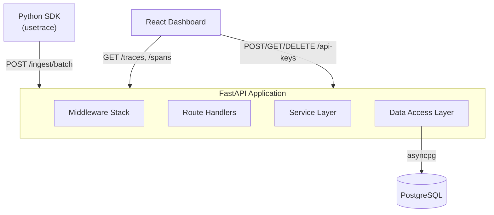
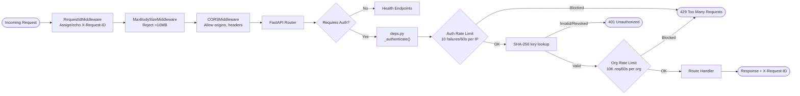
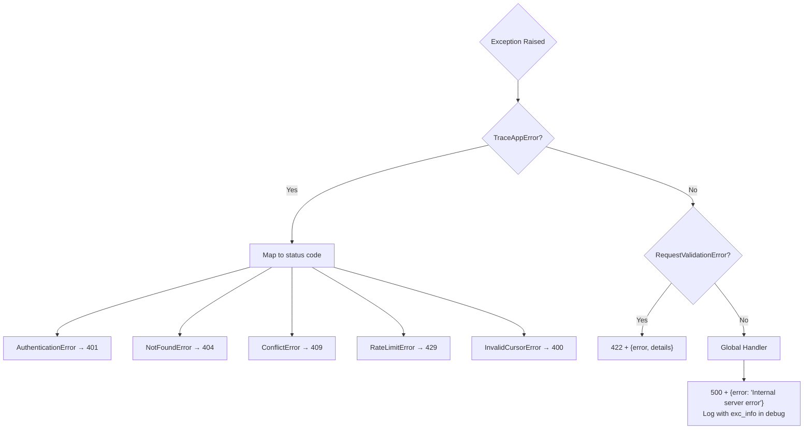
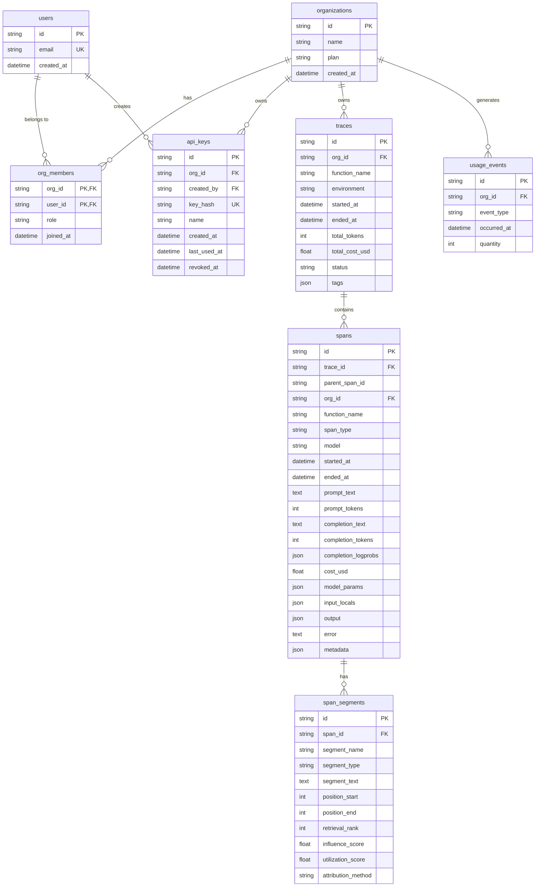
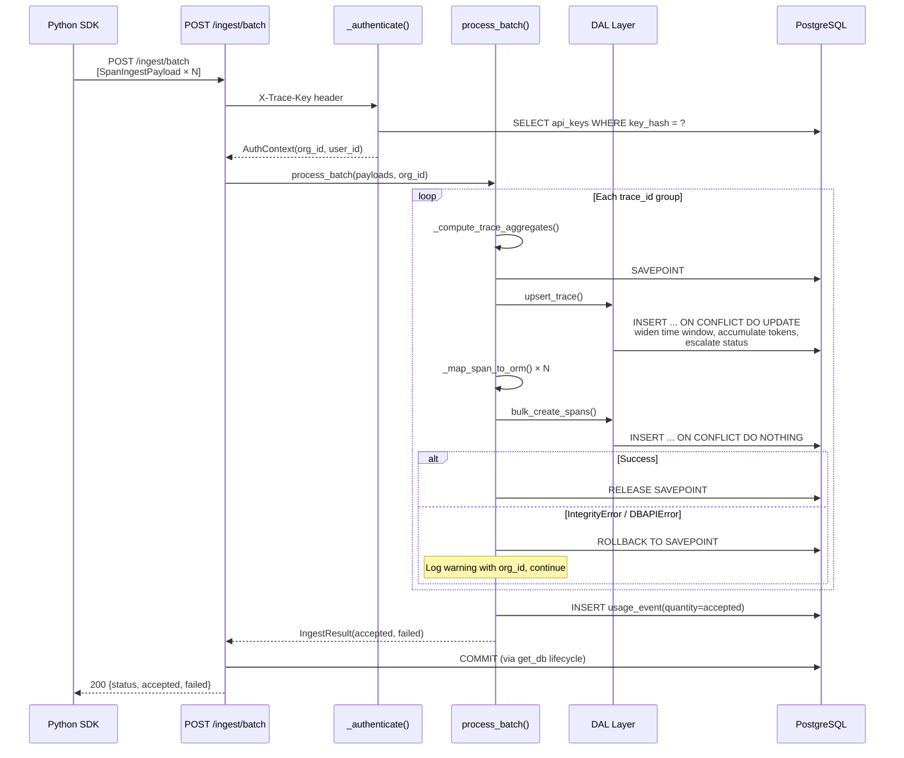
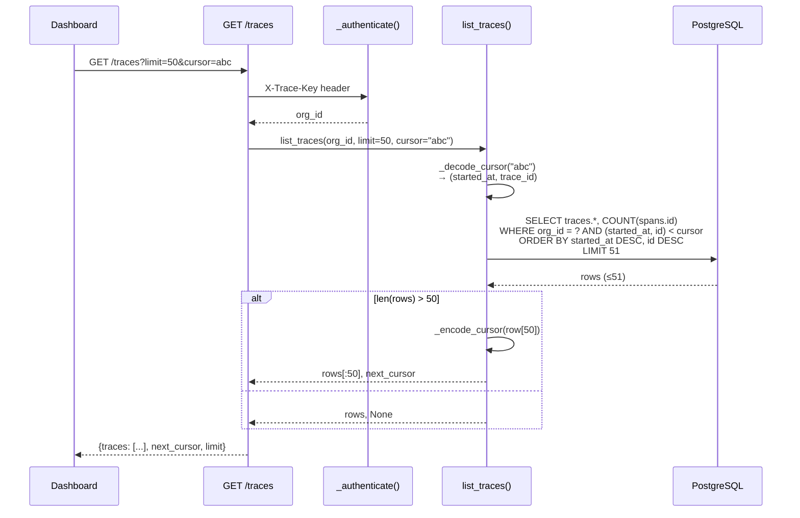
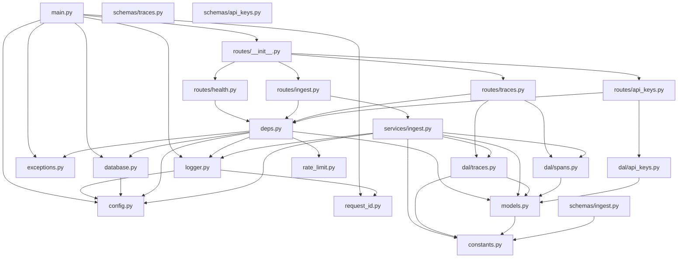
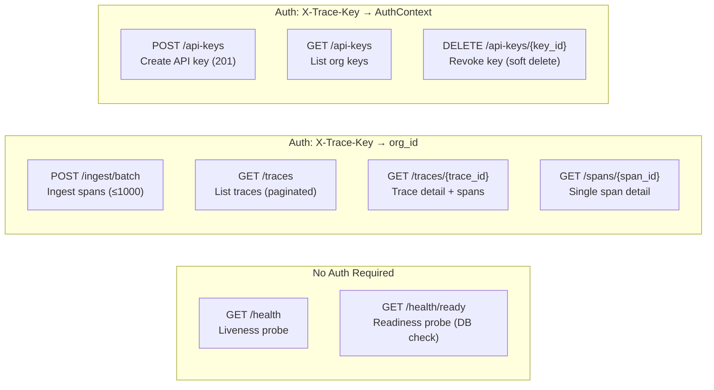
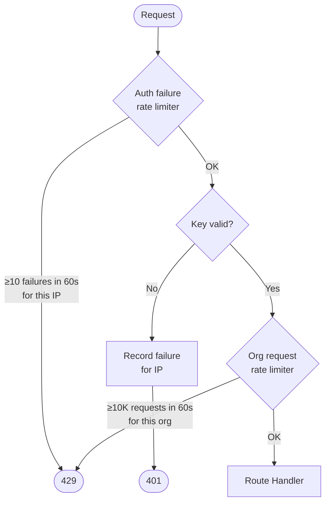
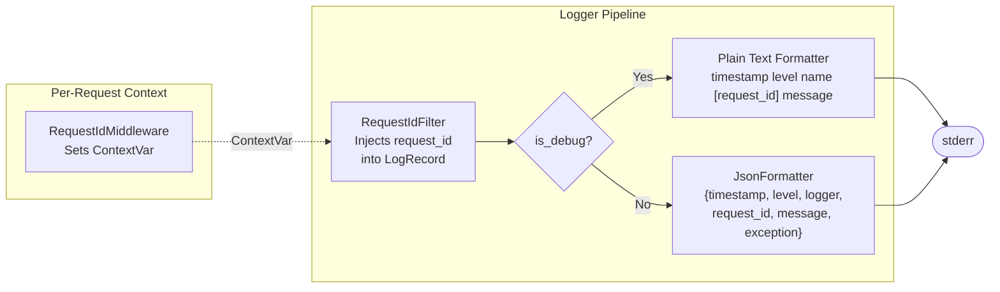

# API Architecture Diagrams

## 1. High-Level Architecture

## 2. Middleware & Request Pipeline

## 3. Exception Handling

## 4. Data Model (ERD)

## 5. Ingestion Flow

## 6. Read Flow (List Traces)

## 7. Module Dependency Graph

## 8. API Endpoints

## 9. Rate Limiting

## 10. Logging Architecture

